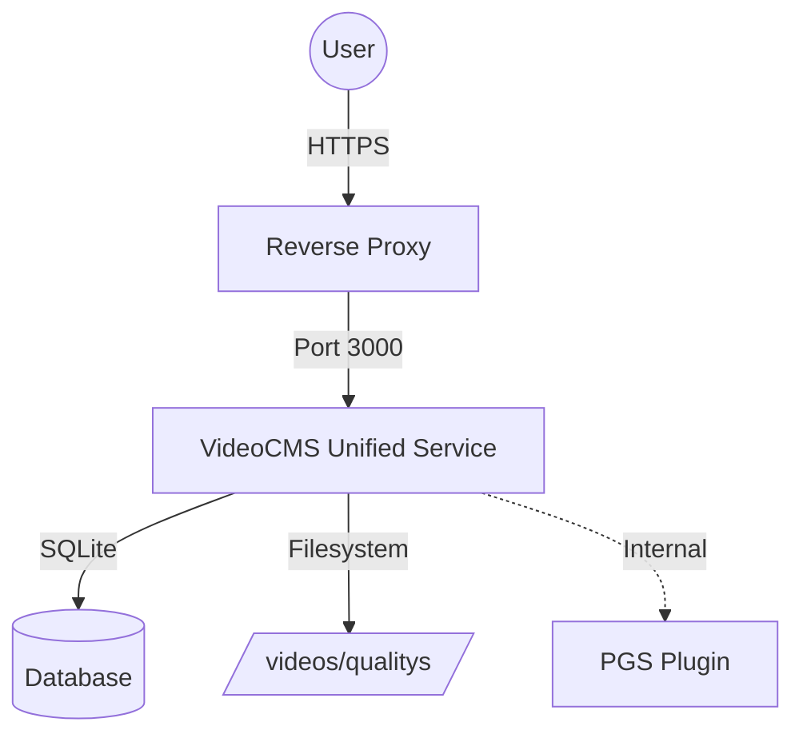

# Architecture

VideoCMS v0.1.0 (Beta) uses a unified architecture where the backend (API) and frontend (Panel) are served by a single service.

## High-Level Overview



## Service Components


## The Transcoding Pipeline

VideoCMS uses a prioritized queue system to handle video processing. This ensures that essential components (like audio and subtitles) are ready before the heavy video encoding begins.

### 1. Upload & Assembly
1.  **Resumable Upload:** The frontend uploads through the embedded tus endpoint at `/api/uploads`. Browser refreshes and network interruptions can resume within the upload retention window.
2.  **Finalize:** After tus reports completion, VideoCMS finalizes the upload and moves the completed raw file from `./videos/uploads/tus/` to `./videos/uploads/{uuid}.tmp`.
3.  **Validation:** `ffprobe` checks the file for valid video streams, resolution (50px - 8000px), and duration.
4.  **Hashing:** A SHA256 hash is generated to detect duplicate files. If a duplicate is found, the new upload acts as a "symlink" to the existing file (Database-level cloning), saving storage space.
5.  **Registration:** The valid file is registered in the database and queued for media processing.

### 2. The Worker Loop
The backend runs a background service (`services/Encoder.go`) that wakes up every 10 seconds to look for pending tasks. It processes them in this specific order:

1.  **Subtitles (Priority 1):**
    *   Extracts embedded subtitles from the source file.
    *   Converts them to `.vtt` (WebVTT) or `.ass` (Advanced Substation Alpha).
    *   *Note:* Image-based subtitles (PGS) are sent to an external plugin for OCR if enabled.

2.  **Audio (Priority 2):**
    *   Extracts audio tracks.
    *   Converts them to HLS Segmented Audio (`.m3u8` + `.ts` segments).
    *   Stereo, 5.1, and 7.1 layouts are supported.

3.  **Video / Qualities (Priority 3):**
    *   Transcodes the video into the resolutions defined in your settings (1080p, 720p, etc.).
    *   Uses **HLS (HTTP Live Streaming)** with `libx264`.
    *   **Settings:** 4-second segments, Closed GOP, YUV420p.

## Download Preparation Queue

Public downloads are prepared by a separate persistent worker rather than inside the attachment request:

1. The download page posts its quality/container/track manifest and immediately receives a job UUID.
2. SQLite stores the FIFO queue. Identical active or unexpired ready manifests reuse the same job and artifact.
3. A separately limited FFmpeg worker packages HLS video, audio, and subtitle inputs with stream copy (`-c copy`) while persisting progress.
4. The page polls lightweight status responses. Reloading a URL containing `?job=<uuid>` resumes the same view.
5. A completed artifact is atomically moved into `./videos/uploads/download-jobs/` and served with Range support.
6. Cleanup expires artifacts after the configured retention period, removes stale partial/orphan files, and recovers interrupted jobs after restart.

Preparation reads are internal filesystem work and do not count as delivery traffic. Actual response bytes are logged as `download`; HLS/player bytes are logged as `player`. The stats API retains the combined total and adds both source series.

## Storage Structure

VideoCMS uses a flat-folder structure where the **Video UUID** is the root folder for that asset.

### `./videos` Directory
This is the main storage volume. You should **never** manually delete files here unless you know what you are doing, as it will break database references.

```text
./videos/
├── uploads/                  # Temporary staging area for raw uploads
│   ├── tus/                  # Active tus upload resources and metadata
│   ├── download-jobs/        # Expiring prepared download artifacts
│   └── {file_uuid}.tmp       # Finalized raw video before/while import
│
└── qualitys/                 # Permanent storage for processed media
    └── {video_uuid}/         # The processed video folder (HLS assets)
        ├── {quality_name}/   # e.g., "1080p", "720p"
        │   ├── index.m3u8    # Playlist for this specific quality
        │   ├── segment0.ts   # Video segment 0
        │   └── segment1.ts   # Video segment 1...
        │
        ├── {audio_uuid}/     # Audio Track 1
        │   ├── index.m3u8
        │   └── segment0.ts
        │
        └── {subtitle_uuid}/  # Subtitle Track 1
            └── subtitle.vtt  # The subtitle file
```

### Where is `master.m3u8`?
You won't find a `master.m3u8` file on the disk. VideoCMS generates the Master Playlist **dynamically** on the fly when a user requests it.

This allows the server to:
1.  Instantly enable/disable specific qualities without re-writing files.
2.  Serve different audio tracks based on user language preferences.
3.  Keep media URLs tokenless while the Go server verifies the HttpOnly media cookie set by the player page.

## Database Flow

VideoCMS uses **SQLite** in WAL (Write-Ahead Logging) mode.

*   **`files` table:** Stores metadata about the physical file (Hash, Path, Duration).
*   **`links` table:** Represents the "User's View" of a file. Multiple users can have different `links` pointing to the same `file` (Deduplication).
*   **`qualities`, `audios`, `subtitles`:** Store the status (`Ready`, `Encoding`, `Failed`) of each asset.
*   **`download_jobs`:** Stores public download manifests, queue/progress state, output metadata, and expiry.
*   **`traffic_logs`:** Stores delivered bytes classified as `player` or `download`.

## Scaling Implications

*   **CPU:** The "Worker Loop" is CPU-intensive. Since it runs inside the API binary, scaling the API horizontally (multiple replicas) requires a shared filesystem (NFS) for `./videos` and a shared database, which SQLite does not support well across networks.
*   **Storage:** Local media stays in `./videos`. Administrators can also connect S3-compatible buckets or SFTP folders and route new uploads through storage pools.
